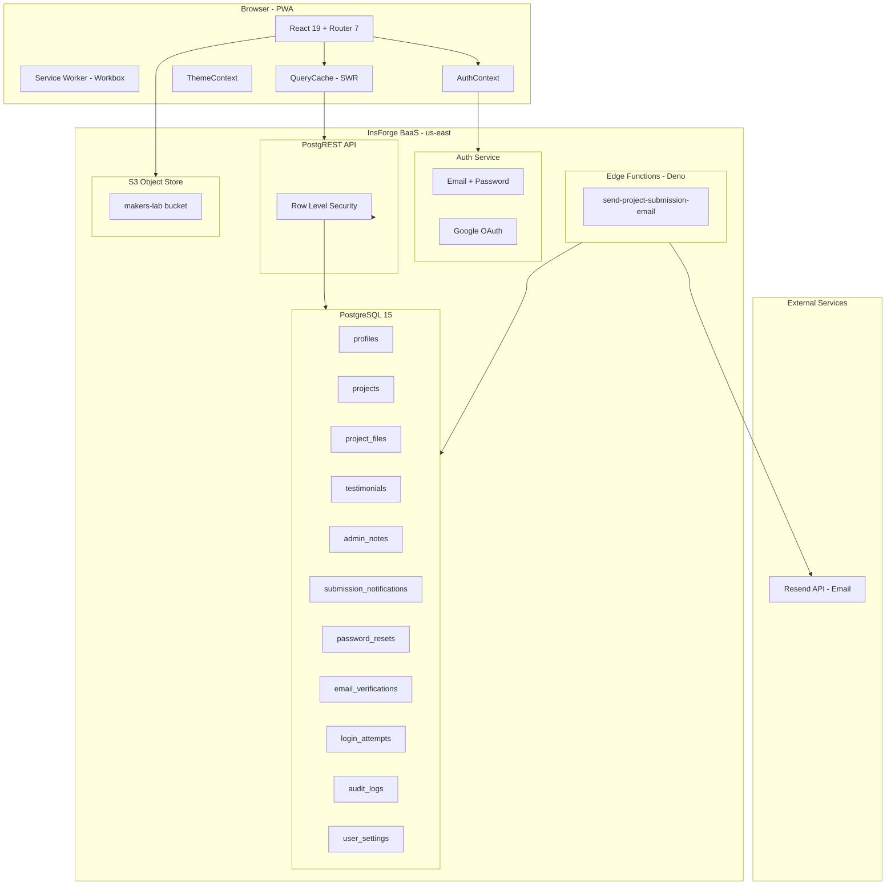
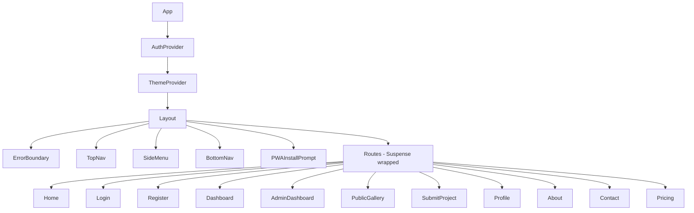
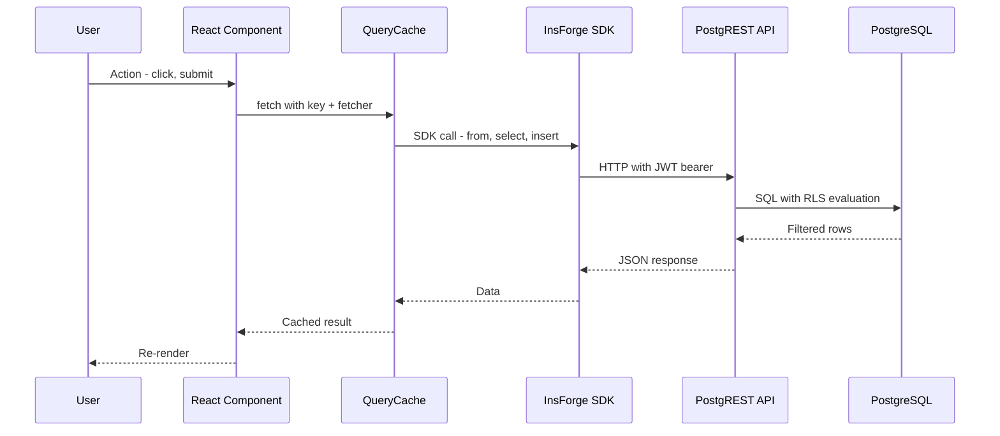
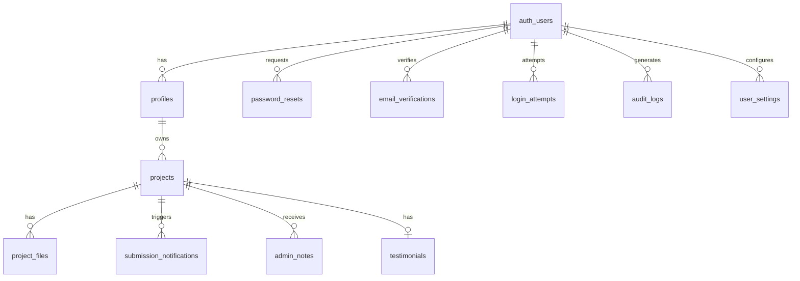

# Markers Lab — Architecture Analysis

**Date:** April 15, 2026  
**Reviewer:** Architect Mode  
**Codebase:** `c:/Users/NHANA_K_OTTO/Desktop/Markers-lab`

---

## 1. Executive Summary

Markers Lab is a **full-stack PWA** for project submission and management, built on **React 19 + Vite 6.4** with an **InsForge BaaS** backend (PostgreSQL 15, PostgREST, Deno Edge Functions, S3 storage). The application supports two user roles (USER, ADMIN), features a public gallery, project submission pipeline with email notifications, and a security monitoring dashboard.

The architecture is **well-structured for a Phase 1 product**, with strong fundamentals in lazy loading, RLS-protected data access, and PWA support. However, several areas need attention as the codebase scales — particularly the oversized data-access layer, incomplete OAuth integration, lack of testing, and documentation sprawl.

---

## 2. System Architecture Diagram

---

## 3. Frontend Architecture

### 3.1 Technology Stack

| Layer | Technology | Version |
|-------|-----------|---------|
| UI Framework | React | 19.2.5 |
| Build Tool | Vite | 6.4.2 |
| Styling | Tailwind CSS | 4.1.14 |
| Routing | React Router DOM | 7.14.0 |
| Animation | Motion | 12.38.0 |
| Charts | Recharts | 3.8.1 |
| Icons | Lucide React | 0.546.0 |
| Markdown | React Markdown + remark-gfm | 10.1.0 |
| PWA | vite-plugin-pwa + Workbox | 1.2.0 |
| BaaS SDK | @insforge/sdk | 1.2.4 |
| Notifications | Sonner | 2.0.7 |
| Progress | NProgress | 0.2.0 |

### 3.2 Route Structure

| Path | Component | Access | Lazy |
|------|-----------|--------|------|
| `/` | Home | Public | Yes |
| `/login` | Login | Guest only | Yes |
| `/register` | Register | Guest only | Yes |
| `/gallery` | PublicGallery | Public | Yes |
| `/pricing` | Pricing | Public | Yes |
| `/about` | About | Public | Yes |
| `/contact` | Contact | Public | Yes |
| `/dashboard` | Dashboard | Auth required | Yes |
| `/submit-project` | SubmitProject | Auth required | Yes |
| `/profile` | Profile | Auth required | Yes |
| `/admin` | AdminDashboard | Admin only | Yes |

### 3.3 Component Hierarchy

### 3.4 Data Flow Pattern

### 3.5 Performance Optimizations

1. **Route Preloading** — [`lazyWithPreload()`](src/App.tsx:11) enables idle-time and interaction-based preloading
2. **Code Splitting** — All pages are lazy-loaded via `React.lazy()`
3. **Query Cache** — [`queryCache`](src/lib/query-cache.ts:18) implements stale-while-revalidate with 60s TTL and request deduplication
4. **PWA/Service Worker** — Workbox caches static assets, Google Fonts, and external images
5. **Route Transition Progress** — NProgress bar during navigation
6. **Scroll Restoration** — Auto scroll-to-top on route change

---

## 4. Backend Architecture

### 4.1 Database Schema — 13 Tables

### 4.2 Row Level Security

All 13 tables have RLS enabled. Key policies:

- **profiles** — Users read/update own; admins read/update all
- **projects** — Users see own + approved; admins see all; users can only mutate PENDING
- **project_files** — Inherit visibility from parent project
- **testimonials** — Public read approved; users create own; admins approve
- **admin_notes** — Admin-only write; project owners can read notes on their projects
- **Security tables** — Users see own records; admins see all

Helper function [`makers_is_admin()`](insforge/rls-policies.sql:8) is `SECURITY DEFINER` — queries `profiles.role = 'ADMIN'` for the current `auth.uid()`.

### 4.3 Edge Functions

| Function | Runtime | Purpose |
|----------|---------|---------|
| `send-project-submission-email` | Deno | Sends styled HTML email to admin inbox via Resend API on project submission |

### 4.4 Storage

- **Bucket**: `makers-lab` (public access for team photos/thumbnails, signed URLs for private project files)
- **Structure**: `team/`, `projects/{projectId}/`, `uploads/{userId}/`

---

## 5. Authentication Architecture

### 5.1 Current Implementation

[`AuthContext`](src/contexts/AuthContext.tsx:19) provides:
- `user` — Current user or null
- `loading` — Auth check in progress
- `authError` — Session expiry or verification failure message
- `login()` — Set user state after successful auth
- `logout()` — Call `insforge.auth.signOut()` then clear state
- `checkAuth()` — Fetch session user via [`fetchSessionUser()`](src/lib/makers-data.ts)
- `recoverSession()` — Logout then re-check auth

### 5.2 Google OAuth Status

[`GoogleSignInButton`](src/components/GoogleSignInButton.tsx:18) is a **stub implementation**:
- Does NOT use `@react-oauth/google` (not in dependencies)
- Simply calls `onSuccess({ provider: 'google' })` on click
- The actual OAuth flow is presumably handled by InsForge's `signInWithOAuth()` elsewhere
- The component comment says "Prerequisites: Install @react-oauth/google" but this was never done

---

## 6. Findings & Recommendations

### 6.1 Critical Issues

| # | Issue | Impact | Location |
|---|-------|--------|----------|
| C1 | **makers-data.ts is 1255 lines** — a God module containing all data access functions, row mappers, and business logic | Maintenance burden, merge conflicts, hard to test | [`src/lib/makers-data.ts`](src/lib/makers-data.ts:1) |
| C2 | **GoogleSignInButton is a stub** — no actual OAuth flow, just passes `{ provider: 'google' }` | Broken Google login UX | [`src/components/GoogleSignInButton.tsx`](src/components/GoogleSignInButton.tsx:25) |
| C3 | **No test infrastructure** — no test runner, no test files, no coverage | Regressions undetected, refactoring is risky | Project-wide |

### 6.2 Significant Issues

| # | Issue | Impact | Location |
|---|-------|--------|----------|
| S1 | **Layout.tsx is 630 lines** — navigation, scroll, route transitions, mobile detection, back-to-top all in one | Hard to modify without side effects | [`src/components/Layout.tsx`](src/components/Layout.tsx:1) |
| S2 | **No route-level error boundaries** — a single component error crashes the entire Suspense fallback | Poor error resilience | [`src/App.tsx`](src/App.tsx:101) |
| S3 | **Type safety gaps** — `any` used in GoogleSignInButton, insforge.functions.invoke, and error catches | Runtime type errors possible | Multiple files |
| S4 | **No formal migration runner** — SQL files are manually executed via CLI | Schema drift risk, no rollback capability | [`insforge/`](insforge/) directory |
| S5 | **Documentation sprawl** — 15+ markdown files at project root | Cluttered repo, outdated docs risk | Project root |

### 6.3 Minor Issues / Improvements

| # | Issue | Impact | Location |
|---|-------|--------|----------|
| M1 | **Package name is generic** — `react-example` in package.json | Misleading identity | [`package.json`](package.json:2) |
| M2 | **No CI/CD pipeline** — ARCHITECTURE.md mentions GitHub Actions but no `.github/workflows/` exists | Manual deployment risk | Project root |
| M3 | **GEMINI_API_KEY in .env.example** but not used in codebase | Confusing for developers | [`.env.example`](.env.example:10) |
| M4 | **Query cache has no eviction policy** — Map grows unbounded | Potential memory leak in long sessions | [`src/lib/query-cache.ts`](src/lib/query-cache.ts:19) |
| M5 | **Auth error messages are generic** — no distinction between network errors and auth errors | Poor debugging UX | [`src/contexts/AuthContext.tsx`](src/contexts/AuthContext.tsx:37) |

---

## 7. Recommended Refactoring Plan

### Phase A: Structural Decomposition

1. **Split `makers-data.ts`** into domain modules:
   - `src/lib/api/projects.ts` — Project CRUD + file management
   - `src/lib/api/auth.ts` — Login tracking, password reset, email verification
   - `src/lib/api/admin.ts` — Admin dashboard queries, audit logs
   - `src/lib/api/profiles.ts` — User profile and settings
   - `src/lib/api/notifications.ts` — Submission notification management
   - `src/lib/api/mappers.ts` — Shared row-to-domain mapping functions

2. **Decompose `Layout.tsx`** into focused components:
   - `Layout.NavBar.tsx` — Top navigation bar
   - `Layout.SideMenu.tsx` — Mobile side drawer
   - `Layout.RouteTransition.tsx` — NProgress + scroll restoration
   - `Layout.BackToTop.tsx` — Scroll-to-top button

3. **Consolidate root documentation** into `/docs` directory, keeping only `README.md` at root

### Phase B: Auth & Security

4. **Implement proper Google OAuth** using InsForge's `signInWithOAuth()` or install `@react-oauth/google`
5. **Add route-level error boundaries** wrapping each lazy route in `App.tsx`
6. **Add query cache eviction** — LRU or max-entries limit

### Phase C: Quality & Testing

7. **Set up Vitest + React Testing Library** — unit tests for data access, integration tests for auth flow
8. **Add CI/CD pipeline** — GitHub Actions for lint, build, test on push to main
9. **Fix type safety** — Replace `any` with proper types, especially in OAuth and SDK calls

### Phase D: Operational

10. **Formalize migration system** — timestamped migration files with up/down scripts
11. **Rename package** from `react-example` to `markers-lab`
12. **Remove unused GEMINI_API_KEY** from `.env.example`

---

## 8. Architecture Strengths

These aspects are well-executed and should be preserved:

- **Lazy loading with preloading strategy** — The [`lazyWithPreload()`](src/App.tsx:11) pattern with idle-callback and interaction-based warming is sophisticated
- **Comprehensive RLS policies** — Every table is protected, with proper user/admin separation
- **Stale-while-revalidate cache** — [`queryCache`](src/lib/query-cache.ts:18) with request deduplication is a solid pattern
- **Route hierarchy for mobile** — [`route-hierarchy.ts`](src/navigation/route-hierarchy.ts:1) handles back-navigation properly for PWA standalone mode
- **PWA configuration** — Well-configured Workbox caching strategies for fonts, images, and static assets
- **Security infrastructure** — Audit logging, brute force detection, and login tracking provide a solid foundation
- **Edge function email pipeline** — Clean separation with Resend API, HTML escaping, and error handling

---

## 9. Technology Decision Assessment

| Decision | Assessment | Rationale |
|----------|-----------|-----------|
| InsForge BaaS | ✅ Good | Eliminates backend ops overhead; RLS + PostgREST is powerful |
| React 19 + Vite 6 | ✅ Good | Modern, fast builds, Suspense support |
| Tailwind CSS 4 | ✅ Good | Rapid UI development, consistent design system |
| Custom QueryCache vs TanStack Query | ⚠️ Consider | Custom cache works but lacks devtools, cache persistence, and automatic refocus refetch |
| No test framework | ❌ Gap | Must add before Phase 2 feature work |
| Manual SQL migrations | ⚠️ Risk | Works for small team but no audit trail or rollback |
| Motion for animations | ✅ Good | Declarative animations with reduced-motion support |

---

*Analysis complete. The codebase is in a solid Phase 1 state with clear paths to improvement.*
