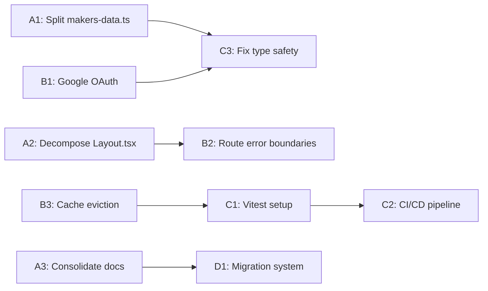

# Markers Lab — Implementation Plan

**Date:** April 15, 2026
**Based on:** [architecture-analysis.md](architecture-analysis.md)
**Status:** Pending approval

---

## Overview

This plan addresses 12 action items across 4 phases, derived from the architecture analysis findings (C1–C3, S1–S5, M1–M5). Each item includes specific file changes, dependencies, and verification steps.

---

## Phase A: Structural Decomposition

### A1: Split `makers-data.ts` into Domain Modules

**Problem:** [`makers-data.ts`](../src/lib/makers-data.ts:1) is 1255 lines — a God module containing all data access, row mappers, and business logic.

**Target Structure:**

```
src/lib/api/
├── index.ts          # Re-exports all public API for backward compatibility
├── mappers.ts        # Row-to-domain mapping functions + Row type definitions
├── projects.ts       # Project CRUD + file management + gallery
├── auth.ts           # Login tracking, password reset, email verification
├── admin.ts          # Admin dashboard queries, audit logs, user management
├── profiles.ts       # User profile and settings
└── notifications.ts  # Submission notification management
```

**Function Assignment:**

| Module | Functions to Move | Lines |
|--------|------------------|-------|
| `mappers.ts` | `mapProjectRow`, `mapProjectFileRow`, `mapTestimonialRow`, `mapAdminNoteRow`, `mapSubmissionNotificationRow` + all `*Row` type definitions | ~95–177 |
| `projects.ts` | `fetchMyProjects`, `deleteMyProject`, `fetchFeaturedGallery`, `fetchApprovedTestimonials`, `createProjectWithFiles`, `updateMyProfile` | ~543–660, 1238–end |
| `auth.ts` | `userFromAuthUser`, `fetchSessionUser`, `validateEmailPasswordLogin`, `trackPasswordResetRequest`, `completePasswordReset`, `getRecentPasswordResets`, `trackLoginAttempt`, `checkBruteForceAttempts`, `logAuditEvent`, `markEmailAsVerified` | ~334–540, 958–1007, 1022–1107, 1178–1188 |
| `admin.ts` | `fetchAdminProjects`, `adminUpdateProject`, `adminDeleteProject`, `adminBulkUpdateProjects`, `adminBulkDeleteProjects`, `adminDeleteProjectFile`, `adminDeleteAdminNote`, `adminUpdateUserProfile`, `adminReassignProject`, `adminCreateTestimonial`, `fetchAdminTestimonials`, `adminSetTestimonialApproved`, `adminDeleteTestimonial`, `fetchAdminUsers`, `adminSetUserRole`, `adminDeleteUserProfile`, `adminGetRecentLoginAttempts`, `adminGetAuditLogs`, `fetchAdminAnalytics` | ~748–960, 1190–1255 |
| `profiles.ts` | `fetchUserSettings`, `updateUserSettings` | ~1110–1177 |
| `notifications.ts` | `fetchAdminSubmissionNotifications`, `adminAcknowledgeSubmissionNotification`, `adminRetrySubmissionNotificationEmail`, `invokeSubmissionEmailFunction` | ~661–747 |

**Key Steps:**
1. Create `src/lib/api/` directory
2. Create `mappers.ts` — move all `*Row` types and `map*Row()` functions; export them for other modules
3. Create `projects.ts` — import mappers, `insforge`, `queryCache`, `BUCKET` constant; move project functions
4. Create `auth.ts` — import `insforge`, mappers; move auth/security functions
5. Create `admin.ts` — import `insforge`, mappers, `queryCache`; move admin functions
6. Create `profiles.ts` — import `insforge`; move settings functions
7. Create `notifications.ts` — import `insforge`, mappers; move notification functions + `invokeSubmissionEmailFunction`
8. Create `index.ts` — re-export everything from sub-modules for backward compatibility
9. Update all import paths across the codebase: replace `from "../lib/makers-data"` / `from "../../lib/makers-data"` with `from "../lib/api"` or specific sub-modules
10. Delete original `makers-data.ts`
11. Verify `npm run build` passes with no errors

**Verification:**
- `npm run build` succeeds
- All existing imports resolve correctly
- No runtime behavior changes

---

### A2: Decompose `Layout.tsx` into Focused Components

**Problem:** [`Layout.tsx`](../src/components/Layout.tsx:1) is 630 lines — navigation, scroll handling, route transitions, mobile detection, and back-to-top all in one component.

**Target Structure:**

```
src/components/layout/
├── Layout.tsx           # Main layout shell - assembles sub-components
├── TopNavBar.tsx        # Desktop top navigation bar + scroll detection
├── SideMenu.tsx         # Mobile side drawer with nav items
├── RouteTransition.tsx  # NProgress + scroll restoration + route measure
└── BackToTop.tsx        # Scroll-to-top floating button
```

**Responsibility Split:**

| Component | State / Logic | Lines |
|-----------|--------------|-------|
| `RouteTransition.tsx` | `useEffect` for NProgress start/done, `beginRouteMeasure`/`endRouteMeasure`, `window.scrollTo` on route change | 34–61 |
| `TopNavBar.tsx` | `isNavScrolled` state, scroll listener, nav items, user avatar, theme toggle, logout button | 111–176, render of top nav |
| `SideMenu.tsx` | `isMenuOpen` state, `closeMenu`, `handleLogout`, nav items list, overlay, back handler via `useOverlayBackHandler` | 78–110, render of side drawer |
| `BackToTop.tsx` | `showBackToTopRef`, scroll listener for >500px, `scrollToTop` handler | 141–175 |
| `Layout.tsx` | Composes the above + `BottomNav`, `PWAInstallPrompt`, `HeroRingBackdrop`, `Toaster`, `<Outlet>` or `{children}` | Shell only |

**Key Steps:**
1. Create `src/components/layout/` directory
2. Extract `RouteTransition.tsx` — takes `location` as prop; handles NProgress, route measure, scroll-to-top
3. Extract `BackToTop.tsx` — self-contained with scroll listener and animated button
4. Extract `TopNavBar.tsx` — takes `user`, `onMenuToggle`, `isNavScrolled` as props; contains nav items, theme toggle, user menu
5. Extract `SideMenu.tsx` — takes `user`, `isOpen`, `onClose` as props; contains mobile nav items, overlay animation
6. Rewrite `Layout.tsx` as thin shell composing the sub-components
7. Update import in [`App.tsx`](../src/App.tsx:4) from `./components/Layout` to `./components/layout/Layout`
8. Verify `npm run build` passes

**Verification:**
- Visual regression check: all navigation, scroll, and transition behavior unchanged
- Mobile menu opens/closes correctly
- Back-to-top button appears after scrolling
- Theme toggle works
- Route progress bar shows on navigation

---

### A3: Consolidate Root Documentation into `/docs`

**Problem:** 15+ markdown files at project root cause clutter and outdated doc risk.

**Files to Move:**

| Current Location | Target |
|-----------------|--------|
| `ARCHITECTURE.md` | `docs/ARCHITECTURE.md` |
| `BACKEND_API_REFERENCE.md` | `docs/BACKEND_API_REFERENCE.md` |
| `BACKEND_ARCHITECTURE.md` | `docs/BACKEND_ARCHITECTURE.md` |
| `BACKEND_AUDIT.md` | `docs/BACKEND_AUDIT.md` |
| `BACKEND_IMPLEMENTATION.md` | `docs/BACKEND_IMPLEMENTATION.md` |
| `BACKEND_SETUP_GUIDE.md` | `docs/BACKEND_SETUP_GUIDE.md` |
| `BACKEND_UPDATE_SUMMARY.md` | `docs/BACKEND_UPDATE_SUMMARY.md` |
| `CONTRIBUTING.md` | Keep at root (standard convention) |
| `DEPLOYMENT_COMPLETE.md` | `docs/DEPLOYMENT_COMPLETE.md` |
| `DEPLOYMENT_GUIDE.md` | `docs/DEPLOYMENT_GUIDE.md` |
| `DEPLOYMENT_RUNBOOK.md` | `docs/DEPLOYMENT_RUNBOOK.md` |
| `INSFORGE_DEPLOYMENT.md` | `docs/INSFORGE_DEPLOYMENT.md` |
| `PHASE_1_DEPLOYMENT_COMPLETE.md` | `docs/PHASE_1_DEPLOYMENT_COMPLETE.md` |
| `PHASE_2_AUTH_INTEGRATION_COMPLETE.md` | `docs/PHASE_2_AUTH_INTEGRATION_COMPLETE.md` |
| `PHASE_2_DECISION_MATRIX.md` | `docs/PHASE_2_DECISION_MATRIX.md` |
| `PHASE_2_IMPLEMENTATION_PLAN.md` | `docs/PHASE_2_IMPLEMENTATION_PLAN.md` |
| `PHASE_2_ROADMAP.md` | `docs/PHASE_2_ROADMAP.md` |
| `PRODUCTION_READY.md` | `docs/PRODUCTION_READY.md` |
| `PROJECT_SUMMARY.md` | `docs/PROJECT_SUMMARY.md` |
| `RLS_FINAL_DEPLOYMENT.md` | `docs/RLS_FINAL_DEPLOYMENT.md` |
| `SECURITY_AUDIT.md` | `docs/SECURITY_AUDIT.md` |
| `SECURITY_TEST_SUITE.md` | `docs/SECURITY_TEST_SUITE.md` |

**Keep at Root:**
- `README.md` — standard entry point
- `CONTRIBUTING.md` — GitHub convention

**Key Steps:**
1. Create `docs/` directory
2. Move all listed files to `docs/`
3. Update any internal cross-references between documents
4. Update `README.md` to link to `docs/` for detailed documentation
5. Verify no broken links

---

## Phase B: Auth and Security

### B1: Implement Proper Google OAuth

**Problem:** [`GoogleSignInButton`](../src/components/GoogleSignInButton.tsx:18) is a stub — just passes `{ provider: 'google' }` with no actual OAuth flow. Uses `any` types.

**Approach:** Use InsForge SDK's built-in `signInWithOAuth()` method since the project already uses `@insforge/sdk`. This avoids adding `@react-oauth/google` as a dependency.

**Key Steps:**
1. Read InsForge SDK docs for `insforge.auth.signInWithOAuth()` — confirm provider config format
2. Update [`GoogleSignInButton.tsx`](../src/components/GoogleSignInButton.tsx:25) to call `insforge.auth.signInWithOAuth({ provider: 'google' })` on click
3. Replace `any` in [`GoogleSignInButtonProps.onSuccess`](../src/components/GoogleSignInButton.tsx:4) with proper type: `{ provider: string; user?: User }`
4. Replace `any` in [catch block](../src/components/GoogleSignInButton.tsx:29) with `unknown` + type guard
5. Add `VITE_GOOGLE_OAUTH_REDIRECT_URL` to [`.env.example`](../env.example:10) if needed by InsForge OAuth flow
6. Configure Google OAuth provider in InsForge dashboard (document in deployment guide)
7. Test the full OAuth flow: click button → Google consent → redirect → session established

**Verification:**
- Google sign-in button triggers actual OAuth redirect
- User session is created after successful Google auth
- Error handling works for denied permissions

---

### B2: Add Route-Level Error Boundaries

**Problem:** A single component error crashes the entire Suspense fallback in [`App.tsx`](../src/App.tsx:101).

**Key Steps:**
1. Create `src/components/RouteErrorBoundary.tsx`:
   - React class component with `componentDidCatch` and `getDerivedStateFromError`
   - Renders a user-friendly error UI with retry button
   - Resets error state when route changes (key by location)
2. Update [`App.tsx`](../src/App.tsx:102) routes to wrap each `<Route>` element with `<RouteErrorBoundary>`:
   ```tsx
   <Route path="/dashboard" element={
     <RouteErrorBoundary>
       <ProtectedRoute><Dashboard /></ProtectedRoute>
     </RouteErrorBoundary>
   } />
   ```
3. Add error boundary around the `<Suspense>` fallback as well
4. Verify `npm run build` passes

**Verification:**
- Throwing an error in one route does not crash other routes
- Error UI shows retry button that recovers the component
- Navigation away from errored route works cleanly

---

### B3: Add Query Cache Eviction Policy

**Problem:** [`queryCache`](../src/lib/query-cache.ts:18) uses an unbounded `Map` — entries are never evicted except by explicit `invalidate()` calls, causing potential memory leaks in long sessions.

**Key Steps:**
1. Add `maxEntries` option to `QueryCache` constructor (default: 100)
2. In the `fetch()` method, after setting a new cache entry, check if `cache.size > maxEntries`
3. If over limit, evict the oldest entry (first key in Map iteration order — Map preserves insertion order)
4. Add `size` getter for monitoring/debugging
5. Update [`queryCache`](../src/lib/query-cache.ts:84) instantiation: `new QueryCache({ maxEntries: 100 })`
6. Verify existing tests still pass (once Vitest is set up in Phase C)

**Implementation Detail:**
```typescript
class QueryCache {
  private cache = new Map<string, CacheEntry<unknown>>();
  private inflight = new Map<string, Promise<unknown>>();
  private maxEntries: number;

  constructor(options?: { maxEntries?: number }) {
    this.maxEntries = options?.maxEntries ?? 100;
  }

  // In fetch(), after cache.set():
  private evictIfNeeded() {
    if (this.cache.size > this.maxEntries) {
      const oldestKey = this.cache.keys().next().value;
      if (oldestKey !== undefined) this.cache.delete(oldestKey);
    }
  }
}
```

**Verification:**
- Cache does not grow beyond `maxEntries`
- Stale-while-revalidate still works correctly
- Explicit `invalidate()` calls still work

---

## Phase C: Quality and Testing

### C1: Set Up Vitest + React Testing Library

**Key Steps:**
1. Install dependencies:
   ```
   npm install -D vitest @testing-library/react @testing-library/jest-dom @testing-library/user-event jsdom
   ```
2. Create `vitest.config.ts` extending Vite config with `test` block:
   ```typescript
   import { defineConfig } from 'vitest/config';
   import react from '@vitejs/plugin-react';

   export default defineConfig({
     plugins: [react()],
     test: {
       globals: true,
       environment: 'jsdom',
       setupFiles: ['./src/test/setup.ts'],
       include: ['src/**/*.{test,spec}.{ts,tsx}'],
     },
   });
   ```
3. Create `src/test/setup.ts` — import `@testing-library/jest-dom`
4. Add scripts to [`package.json`](../package.json:6):
   ```json
   "test": "vitest run",
   "test:watch": "vitest",
   "test:coverage": "vitest run --coverage"
   ```
5. Write initial test files:
   - `src/lib/__tests__/query-cache.test.ts` — unit tests for cache hit, miss, stale-while-revalidate, eviction, invalidation
   - `src/lib/__tests__/mappers.test.ts` — unit tests for all row mapping functions
   - `src/components/__tests__/GoogleSignInButton.test.tsx` — render test, click handler test
6. Verify `npm test` passes

---

### C2: Add CI/CD Pipeline

**Key Steps:**
1. Create `.github/workflows/ci.yml`:
   ```yaml
   name: CI
   on:
     push:
       branches: [main]
     pull_request:
       branches: [main]

   jobs:
     build-and-test:
       runs-on: ubuntu-latest
       steps:
         - uses: actions/checkout@v4
         - uses: actions/setup-node@v4
           with:
             node-version: 20
             cache: npm
         - run: npm ci
         - run: npm run lint
         - run: npm run build
         - run: npm test
   ```
2. Verify workflow runs on next push

---

### C3: Fix Type Safety

**Locations of `any` usage:**

| File | Line | Current | Fix |
|------|------|---------|-----|
| [`GoogleSignInButton.tsx`](../src/components/GoogleSignInButton.tsx:4) | 4 | `onSuccess: (googleData: any) => void` | Define `OAuthResult` type: `{ provider: string; user?: User }` |
| [`GoogleSignInButton.tsx`](../src/components/GoogleSignInButton.tsx:29) | 29 | `catch (err: any)` | Use `catch (err: unknown)` with type guard |
| [`makers-data.ts`](../src/lib/makers-data.ts:185) | 185 | `(insforge.functions as any).invoke(...)` | Type the InsForge functions client properly |
| [`types.ts`](../src/types.ts:170) | 170 | `old_values?: Record<string, any>` | Use `Record<string, unknown>` |
| [`types.ts`](../src/types.ts:171) | 171 | `new_values?: Record<string, any>` | Use `Record<string, unknown>` |

**Key Steps:**
1. Update [`types.ts`](../src/types.ts:170) — replace `Record<string, any>` with `Record<string, unknown>` in `AuditLog` interface
2. Create `src/types/insforge.d.ts` — type augmentation for InsForge SDK's `functions.invoke()` if needed
3. Update [`GoogleSignInButton.tsx`](../src/components/GoogleSignInButton.tsx:4) — proper types for props and error handling
4. Update [`makers-data.ts`](../src/lib/makers-data.ts:185) (or its extracted module) — properly type `insforge.functions.invoke()`
5. Run `npm run lint` to verify no type errors

---

## Phase D: Operational

### D1: Formalize Migration System

**Problem:** SQL files in [`insforge/`](../insforge/) are manually executed with no audit trail or rollback capability.

**Key Steps:**
1. Create `insforge/migrations/README.md` documenting the migration convention
2. Establish naming convention: `YYYY-MM-DD_HHMM_descriptive_name.sql`
3. Create `insforge/migrations/_applied.log` — track which migrations have been executed (timestamp + filename + checksum)
4. Create a simple migration runner script `scripts/run-migration.ps1`:
   - Takes a SQL file path as argument
   - Computes SHA256 checksum
   - Checks against `_applied.log` to prevent re-execution
   - Executes the SQL via `npx @insforge/cli db execute`
   - Appends to `_applied.log` on success
5. Document the process in `docs/` after A3 consolidation

---

### D2: Rename Package

**Key Steps:**
1. Update [`package.json`](../package.json:2): change `"name": "react-example"` to `"name": "markers-lab"`
2. Verify no other references to `react-example` exist in the codebase
3. Run `npm install` to update lockfile
4. Verify `npm run build` passes

---

### D3: Remove Unused `GEMINI_API_KEY`

**Key Steps:**
1. Remove line 10 from [`.env.example`](../env.example:10): `GEMINI_API_KEY=`
2. Search codebase for any references to `GEMINI_API_KEY` and remove them
3. Verify no build errors

---

## Dependency Graph



**Recommended execution order:**
1. A3, D2, D3 — quick wins, no dependencies
2. A1 — foundational, unblocks C3
3. A2 — foundational, unblocks B2
4. B3 — small, self-contained
5. B1 — depends on InsForge SDK investigation
6. B2 — depends on A2
7. C3 — depends on A1 and B1
8. C1 — depends on B3 for cache tests
9. C2 — depends on C1
10. D1 — independent, can be done anytime

---

## Risk Mitigation

| Risk | Mitigation |
|------|-----------|
| Breaking imports when splitting makers-data.ts | Use `index.ts` re-export barrel for backward compatibility; verify with `npm run build` after each module extraction |
| Visual regression from Layout decomposition | Test each extracted component individually; compare before/after in browser |
| InsForge SDK OAuth API differs from assumption | Read SDK source/docs before implementing B1; create a small test script first |
| Migration runner script platform compatibility | Use PowerShell since project already uses `.ps1` scripts; document for cross-platform |
